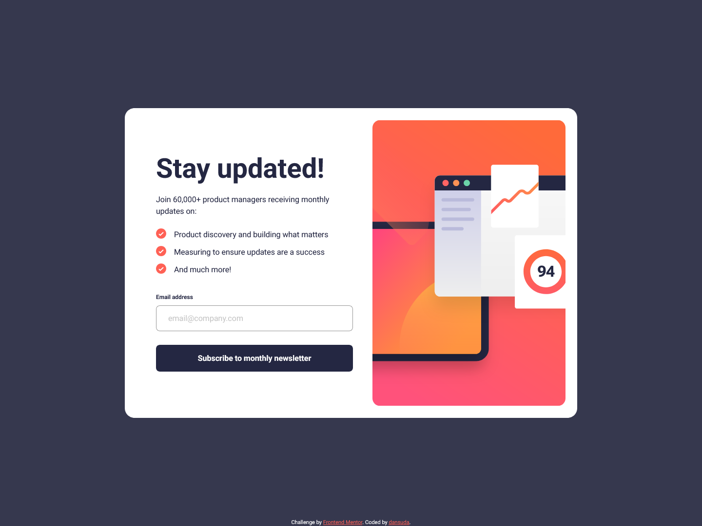
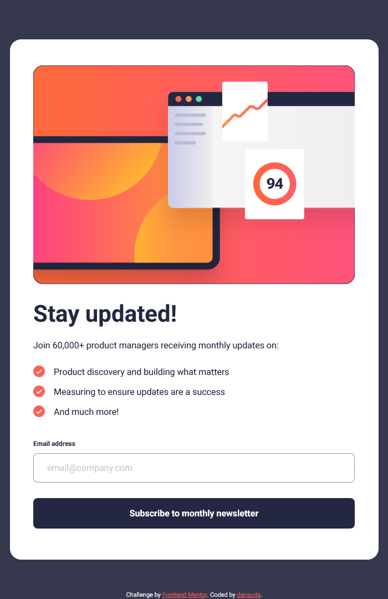
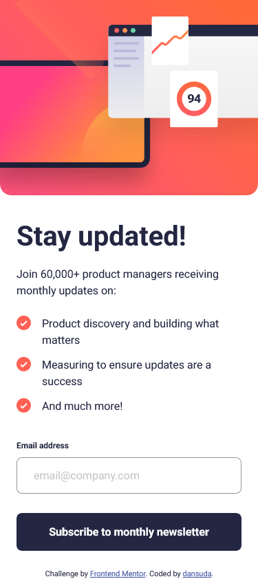

# Frontend Mentor - Newsletter sign-up form with success message solution

This is a solution to the [Newsletter sign-up form with success message challenge on Frontend Mentor](https://www.frontendmentor.io/challenges/newsletter-signup-form-with-success-message-3FC1AZbNrv). Frontend Mentor challenges help you improve your coding skills by building realistic projects. 

## Table of contents

- [Overview](#overview)
  - [The challenge](#the-challenge)
  - [Screenshot](#screenshot)
  - [Links](#links)
- [My process](#my-process)
  - [Built with](#built-with)
  - [What I learned](#what-i-learned)
  - [Continued development](#continued-development)
  - [Useful resources](#useful-resources)
- [Author](#author)

## Overview

### Screenshot

### Links

- Solution URL: (https://github.com/dansuda/newsletter-sign-up-with-success-message)
- Live Site URL: (https://dansuda.github.io/newsletter-sign-up-with-success-message)

## My process

### Built with

- Semantic HTML5 markup
- CSS custom properties
- CSS Flexbox
- SASS/SCSS [https://sass-lang.com/]
- Mobile first workflow
- JavaScript

### What I learned

- I learnt about Client-side Form Validation using "The Constraint Validation API" which makes things much easier than doing the validation manually. 
- I also learnt how I can use the `required` attribute of the `input` element in conjunction with Javascript to change the style of the element if the condition has been satisfied by changing the class Name of the element.

### Continued development

This was a fun project. JavaScript is many times more difficult than HTML and CSS to learn, so I will have to do A LOT more practice with it to even get slighty comfortable with it.

### Useful resources

- (https://www.w3schools.com) - This helped me to understand how to use various css rules and how important they are. 
- (https://www.stackoverflow.com) - This is an amazing website which has really old questions but are still relevant to people like me today who seem to have joined this bandwagon very late. It's nice and helpful they've been around for so long.

## Author

- Github - [dansuda](https://www.github.com/dansuda)
- Frontend Mentor - [@dansuda](https://www.frontendmentor.io/profile/dansuda)
